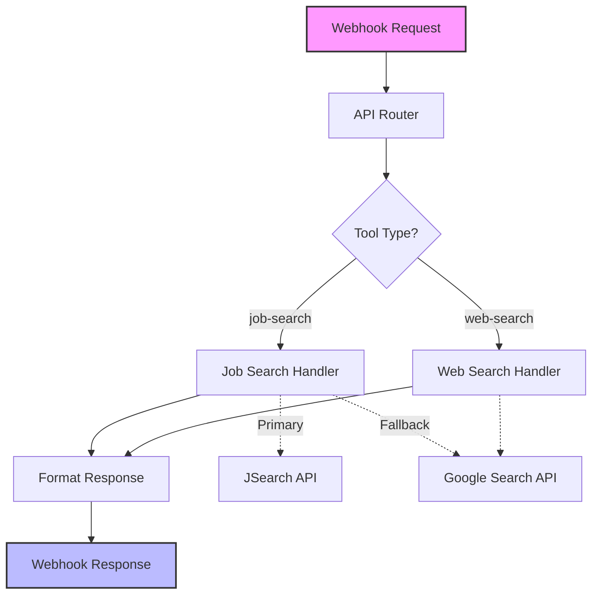

# n8n-next-server

A Next.js implementation of an n8n workflow that handles custom tool calls for AI agents. This project provides webhook endpoints that emulate n8n functionality for job searching and web searching.

## Architecture



## Project Structure

```
pages/
  api/
    webhook.js (main API endpoint)
    tools/
      job-search.js (job search implementation)
      web-search.js (web search implementation)
lib/
  google-api.js (Google API client)
```

## How It Works

1. **Webhook Endpoint**: Receives requests at `${NEXT_PUBLIC_PRODUCTION_URL}/api/webhook`
2. **Tool Routing**: Routes to the appropriate tool handler based on the function name
3. **Tool Execution**: Executes the tool-specific logic and generates results
4. **Response Formatting**: Returns results in the required format with the original toolCallId

## API URL Structure

- Development: `http://localhost:3000/api/webhook`
- Production: `${NEXT_PUBLIC_PRODUCTION_URL}/api/webhook`

## Environment Variables

Create a `.env.local` file with the following variables:

```
# Required: Google API for search functionality
NEXT_PUBLIC_GOOGLE_API_KEY=your_google_api_key_here

# Optional: Google Custom Search Engine ID (for more targeted search results)
NEXT_PUBLIC_SERPER_API_KEY=your_search_engine_id_here

# Optional: RapidAPI key for JSearch API (job search functionality)
NEXT_PUBLIC_RAPID_API_KEY=your_rapid_api_key_here

# Production URL (used for webhook callbacks)
NEXT_PUBLIC_PRODUCTION_URL=https://your-production-url.com
```

## Setup Instructions

1. Clone the repository:
   ```bash
   git clone https://github.com/yourusername/n8n-next-server.git
   cd n8n-next-server
   ```

2. Install dependencies:
   ```bash
   npm install
   ```

3. Create a `.env.local` file with your API keys (see above)

4. Run the development server:
   ```bash
   npm run dev
   ```

5. Access the API at: `http://localhost:3000/api/webhook`

## Production Deployment

When deploying to production:

1. Set the environment variables in your hosting platform
2. Update tools in your AI agent to point to:
   ```
   ${NEXT_PUBLIC_PRODUCTION_URL}/api/webhook
   ```

## Adding New Tools

To add a new tool:

1. Create a new handler file in `pages/api/tools/`
2. Implement the tool logic with an exported handler function
3. Update the webhook.js switch statement to route to your new tool

## License

MIT
